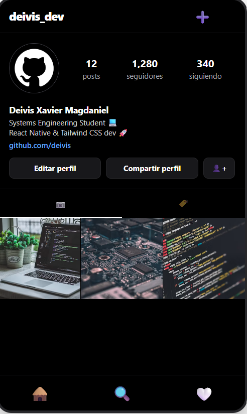

Este proyecto presenta un repositorio inspirado en la interfaz comercial de Instagram. Desarrollado de manera íntegra con clases de utilidad de Tailwind CSS y NativeWind, aplicando componentes core de React Native como SafeAreaView, ScrollView, TextInput, Image y Pressable para cumplir con los estándares de diseño y usabilidad, usando los conocimientos obtenido en clases y apoyo de inteligencia artificial en su construción, presentado por Deivis Xavier Magdaniel Moscote y Ramiro Jose Agamez Gomez.
